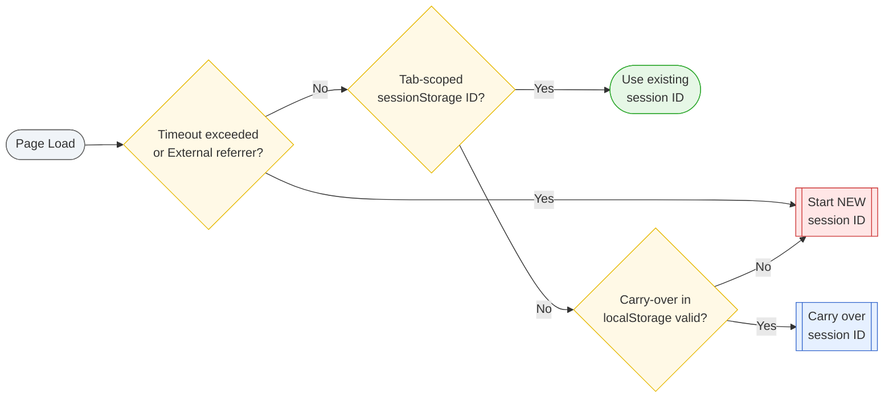

# GTM Marketing Session ID

A lightweight, consent-controlled GTM solution for precise, marketing-defined session tracking — with cross-tab continuity, inactivity timeouts, and external referrer detection.

→ **Tracks real-world journeys, not just browser behavior.**

## Overview

**GTM Marketing Session ID (MSID)** gives you a reliable, consent-controlled way to define and track marketing sessions via Google Tag Manager — without relying on cookies. It replaces the browser’s default “technical” session logic with a lightweight, GTM-managed model that reflects real user journeys.

### The Problem

Default **browser session behavior** is purely technical:

* A session lasts as long as the stored data (cookie or sessionStorage) remains available
* It does **not** necessarily reset when there’s a real break in the user journey
* Tabs opened hours apart can still be counted as the same session
* Sessions may persist even if the browser appears to be closed

Two common causes for unexpected session persistence:

1. **Browser process not fully terminated**  
   On macOS (and sometimes Windows), closing the window may not end the browser process.  
   Session-scoped data in RAM (e.g., `sessionStorage`) remains intact, so reopening a window continues the same browser session.

2. **“Reopen previous tabs on startup” feature**  
   Some browsers restore `sessionStorage` from saved state when reopening tabs after a full quit.  
   This can reconstruct the previous session even though the process was stopped, making it appear as if no new session has started.

> **Technical session** = Defined by browser storage lifecycle (cookie, sessionStorage, etc.)  → Ends only when storage is cleared or expires

This often conflicts with **marketing session logic**, where:

* The session should **end** after a defined period of inactivity (e.g., 30 minutes)
* The session should **restart** when a user comes via a new referrer or campaign click
* The session should **continue** only if the journey context is still valid

> **Marketing session** = Defined by business logic and user behavior  → Ends on inactivity timeout or new traffic source, even if storage persists

### The Solution

MSID solves this by combining:

* **Tab-specific** `sessionStorage` to ensure each tab has its own lifecycle
* **Rule-controlled** `localStorage` to allow cross-tab continuation only when within timeout and no external referrer is detected
* **Configurable marketing rules** that precisely define when to start, continue, or end a session

 → The MSID approach **sits above** the technical session layer, adding marketing rules to control continuation or restart. This ensures your analytics systems reflect **real-world journeys**, not just browser behavior.

### Benefits

* Accurate session boundaries → cleaner attribution and funnel analysis
* Stable IDs across all GTM tags in the same pageview → no race conditions
* Fully first-party, lightweight, and privacy-compliant → no PII, no fingerprinting, no ITP/ETP issues
* Runs entirely client-side under GTM consent control

## Technical Considerations

**Why not just use cookies?**

* First-party session cookies are shared across tabs in the same browser session
* Closing and reopening a tab does not create a new session ID
* Impossible to detect “soft” session breaks without extra logic

**Why sessionStorage + localStorage?**

* `sessionStorage` resets on tab close → gives us a natural session boundary
* `localStorage` persists across tabs → lets us re-use session IDs only when rules allow (recent activity, no new referrer)
* Hybrid approach = fine-grained lifecycle control + marketing-accurate session handling

## Key Features

* Pure client-side, GTM-controlled session tracking
* Configurable inactivity timeout (default: 30 minutes)
* Optional cross-tab continuation within timeout window
* Automatic session reset on external referrer
* Works in modern browsers without ITP/ETP issues
* Fully consent-compliant if triggered via GTM consent logic
* Session ID stable within a pageview for all tags
* Lightweight: one variable + one persistence tag

## What Problem Does MSID Solve?

| 🔍 Problem | ✅ MSID Solution |
|:------------|:-----------------|
| Default browser session behavior doesn’t match marketing needs (sessions stay alive for hours if the browser isn’t closed) | MSID replaces browser lifecycle rules with marketing-defined boundaries (timeout + external referrer checks) |
| First-party session cookies are shared across all tabs and can’t detect “soft” session breaks | MSID uses `sessionStorage` for tab-specific lifecycles, ensuring each new tab starts fresh unless rules allow continuation |
| Need to continue a session across tabs only when context is still valid | MSID stores the current session ID in `localStorage` and reuses it only if the last activity is within the timeout and the entry is not from an external referrer |
| In GTM, all tags must receive the same session ID immediately, even on the first pageview | MSID exposes the session ID via a central GTM variable so it’s available to all tags without race conditions |
| Must avoid cookies due to consent or privacy restrictions | MSID stores data only in `sessionStorage` and `localStorage` — no cookies, no fingerprinting, no PII |
| Need to control exactly when session tracking runs | MSID runs only if triggered via GTM consent logic, giving full compliance with GDPR, ePrivacy, and other regulations |
| ITP/ETP can interfere with some storage methods | MSID’s hybrid storage approach is unaffected by ITP/ETP limits on cookies, ensuring consistent behavior in modern browsers |

## Session Lifecycle Logic

The following decision flow illustrates how the GTM Marketing Session ID (MSID) decides whether to start a new session or continue an existing one. It shows the exact evaluation order and conditions (tab storage, cross-tab carry-over, timeout, external referrer).

## Components

* **`msSessionId.js`** 
GTM Custom JavaScript variable that resolves the Marketing Session ID (MSID) on first evaluation; applies marketing rules (inactivity timeout + external referrer) and optional cross-tab carryover; caches the result on window.__ms.sessionId for the entire pageview; performs no storage writes. 
→ Provides a single, stable MSID to all tags without tag-order dependencies; purely read/decide/cache logic.

* **`msid_controller.html`** 
GTM Custom HTML tag that persists the resolved MSID to storage after consent; writes ms_sessionId (sessionStorage), ms_currentSessionId and ms_lastActivityTs (localStorage); uses decision flags exposed on window.__ms._signals by msSessionId.js; contains no cookie logic. 
→ Persists the ID only when allowed (consent-bound), enables controlled cross-tab continuation, and keeps the activity timestamp up to date.

## Installation Guide

**1. Add the `msSessionId.js` variable** 

- In GTM, create a new Custom JavaScript Variable.
- Paste the full contents of `msSessionId.js`.
- Save as `JS – MSID Resolver` (or similar).

→ This variable must be evaluated before any tags that need the session ID. GTM handles this automatically when the variable is referenced in a tag.

**2. Add the `msid_controller.html` tag** 

- In GTM, create a new Custom HTML Tag.
- Paste the full contents of `msid_controller.html`.
- Set the trigger to fire only after consent (e.g., `Consent – Analytics Granted`).

→ This tag will write values to `sessionStorage` and `localStorage` using the decision flags from `msSessionId.js`.

**3. Use the MSID in your tags** 

Anywhere you need the Marketing Session ID (GA4, server-side forwarding, etc.), use the variable created in step 1.

**4. Configure timeout and logic (optional)** 

- In `msSessionId.js`, adjust `TIMEOUT_MIN` to your preferred inactivity threshold (default: 30 minutes).
- The script already resets the session on external referrer or after timeout.
- You can customize the referrer logic if needed (e.g., to treat subdomains as “external”).

**5. Publish and test**

Use GTM Preview mode to confirm:

- MSID persists across tabs only when within timeout and without external referrer.
- MSID resets correctly when expected.
- No storage writes occur before consent.

Open DevTools → Application → Storage to inspect sessionStorage and localStorage values:

- ms_sessionId → tab-specific ID.
- ms_currentSessionId → cross-tab carryover ID (only if allowed).
- ms_lastActivityTs → timestamp of last activity.

## License

MIT – see [LICENSE](./LICENSE)

## Author

/ MEDIAFAKTUR – Marketing Performance Precision, [https://mediafaktur.marketing](https://mediafaktur.marketing)  
Florian Pankarter, [fp@mediafaktur.marketing](mailto:fp@mediafaktur.marketing)